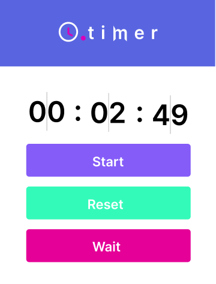

<h1 align="center">
    
</h1>

  <a href="#-technologies">Technologies</a>&nbsp;&nbsp;&nbsp;|&nbsp;&nbsp;&nbsp;
  <a href="#-projeto">Project</a>&nbsp;&nbsp;&nbsp;|&nbsp;&nbsp;&nbsp;
  <a href="#-layout">Layout</a>&nbsp;&nbsp;&nbsp;|&nbsp;&nbsp;&nbsp;
  <a href="#memo-licence">Licence</a>

 

  

 

  

## 🚀 Tecnologies

This project was developed with folowing technologies:

- [Node.js](https://nodejs.org/en/)
- [React](https://reactjs.org)
- [React Native](https://facebook.github.io/react-native/)
- [TypeScript](https://www.typescriptlang.org/)

## 💻 Project
Timer is a project that is used to track time 💜

## How to use
- yarn to download all dependencies.
- yarn dev to run the project.
## :memo: Licence
This project is licenced by MIT. Check the licence file [LICENSE](LICENSE.md) for more details
---

<<<<<<< HEAD
Made by ♥ Horacio Sapato 
=======